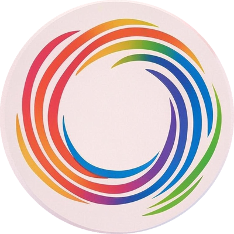

<div style="display: flex; align-items: flex-end; margin-bottom: 20px">
  
  <h1 style="position: relative; top: 16px;">Kasragay Frontend</h1>
</div>

---

## This foundation is inspired by Kasra's gayness

[](https://kasragay.com/) [](https://api.kasragay.com)

[](https://t.me/kasra_gay) [](https://discord.gg/PghhrARr)

[](https://creativecommons.org/licenses/by-nc-sa/4.0/)

---

## How to Use?
**Just do** `ssh kasragay.com` **to try it out.**

---

## Commands

---

```bash```


### Environment Variables

---

```env```
